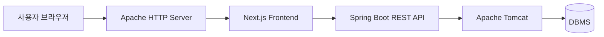
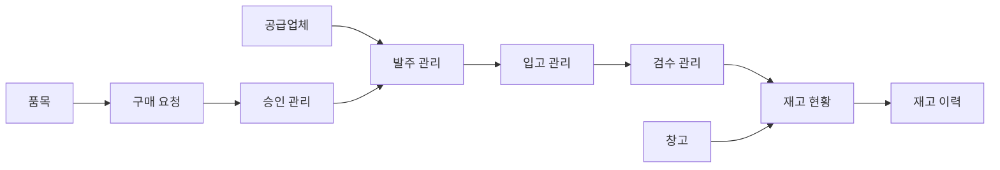

# BuyFlow ERP Frontend

구매 요청부터 승인, 발주, 입고, 검수, 재고 관리까지 물류 업무의 흐름을 통합적으로 관리하기 위한 **BuyFlow ERP 시스템의 프론트엔드 애플리케이션**입니다.

본 저장소는 JavaScript ES6+ 기반의 React와 Next.js를 사용하여 구성합니다.
백엔드는 Spring Boot 기반 REST API 서버와 연동할 예정입니다.

---

## 1. 프로젝트 개요

### 프로젝트명

```text
BuyFlow ERP
```

### Repository

```text
frontend-buyflow
```

### 프로젝트 목적

기업 또는 조직 내부에서 발생하는 구매 및 재고 관리 업무를 하나의 시스템에서 처리할 수 있도록 물류 ERP 서비스를 구현합니다.

기존의 수기 문서, 개별 파일, 단순 목록 중심 업무에서 벗어나 다음 업무 흐름을 체계적으로 관리하는 것을 목표로 합니다.

```text
품목·공급업체·창고 관리
        ↓
구매 요청 등록
        ↓
승인 또는 반려
        ↓
발주 처리
        ↓
입고 처리
        ↓
검수 처리
        ↓
재고 반영 및 이력 관리
```

---

## 2. 주요 기능

### 대시보드

- 물류 업무 현황 요약
- 납기 지연 발주 건수 확인
- 승인 대기 요청 건수 확인
- 입고 예정 건수 확인
- 검수 대기 건수 확인
- 안전재고 부족 품목 확인
- 월별 입고 현황 차트
- 재고 상태 비율 차트
- 최근 구매 요청 목록
- 안전재고 부족 품목 목록

### 기준정보 관리

- 품목 관리
- 공급업체 관리
- 창고 관리

### 구매 및 입고 관리

- 구매 요청 등록 및 조회
- 구매 요청 승인 및 반려
- 발주 관리
- 입고 관리
- 검수 관리

### 재고 관리

- 재고 현황 조회
- 창고별 재고 확인
- 안전재고 부족 품목 확인
- 재고 변동 이력 조회

### 시스템 관리

- 사용자 관리
- 권한 관리
- 시스템 설정

---

## 3. 시스템 아키텍처

BuyFlow ERP는 프론트엔드, 백엔드, 데이터베이스를 분리한 3-Tier 구조를 기준으로 구성합니다.



### 구성 요소

| 구분          | 기술                                         |
| ------------- | -------------------------------------------- |
| Frontend      | React, Next.js, JavaScript ES6+              |
| Web Server    | Apache HTTP Server                           |
| Backend       | Spring Boot REST API                         |
| WAS           | Apache Tomcat 10 이상                        |
| JDK           | Java 17                                      |
| DBMS          | Oracle, MariaDB 또는 PostgreSQL 중 확정 예정 |
| Container     | Docker                                       |
| Orchestration | Kubernetes                                   |
| CI/CD         | GitHub Actions 또는 Jenkins                  |

---

## 4. ERD 개요

현재 ERD는 물류 ERP 업무 흐름을 기준으로 설계하고 있습니다.

세부 테이블명과 컬럼 정의는 DB 명세서에서 관리하며, README에서는 데이터 구조를 업무 영역 단위로 설명합니다.

### 데이터 영역

| 영역           | 주요 데이터                           |
| -------------- | ------------------------------------- |
| 사용자 및 권한 | 사용자, 역할, 접근 권한               |
| 기준정보       | 품목, 공급업체, 창고                  |
| 구매 요청      | 구매 요청, 구매 요청 상세             |
| 승인 관리      | 승인 상태, 승인 및 반려 이력          |
| 발주 관리      | 발주 정보, 발주 상세 품목             |
| 입고 관리      | 입고 정보, 입고 상세 품목             |
| 검수 관리      | 검수 결과, 검수 상태                  |
| 재고 관리      | 창고별 재고, 안전재고, 재고 변동 이력 |

### 핵심 데이터 흐름



### ERD 이미지


---

## 5. 대시보드 UI 구성

대시보드는 로그인 후 사용자가 가장 먼저 확인하는 화면입니다.

업무 담당자가 구매, 입고, 검수, 재고 상태를 빠르게 파악할 수 있도록 요약 카드, 차트, 목록 영역으로 구성합니다.

### 대시보드 레이아웃

| 영역               | 구성 내용                                                     |
| ------------------ | ------------------------------------------------------------- |
| 상단 Header        | 창고 선택, 통합 검색, 알림, 사용자 메뉴                       |
| 좌측 Sidebar       | 업무 기능별 메뉴                                              |
| 현황 요약 카드     | 납기 지연, 승인 대기, 입고 예정, 검수 대기, 안전재고 부족     |
| 월별 입고 현황     | 월별 입고 수량을 비교하는 막대 차트                           |
| 재고 상태 비율     | 정상 재고, 안전재고 이하, 재고 부족 상태를 비교하는 원형 차트 |
| 최근 구매 요청     | 최근 등록된 구매 요청 목록                                    |
| 안전재고 부족 품목 | 우선 확인이 필요한 부족 품목 목록                             |

### Sidebar 메뉴

```text
대시보드

기준정보 관리
├── 품목 관리
├── 공급업체
└── 창고 관리

구매 및 입고
├── 구매 요청
├── 승인 관리
├── 발주 관리
├── 입고 관리
└── 검수 관리

재고 관리
├── 재고 현황
└── 재고 이력

설정
└── 시스템 관리
```

### 대시보드 UI 이미지


---

## 6. 화면 개발 계획

대시보드 UI 시안을 기준으로 업무 기능별 상세 화면을 순차적으로 개발합니다.

| 구분        | 화면                  | URL                              | 개발 상태         |
| ----------- | --------------------- | -------------------------------- | ----------------- |
| 인증        | 로그인                | `/login`                         | 개발 예정         |
| 대시보드    | 현황 요약             | `/dashboard`                     | UI 시안 구성 완료 |
| 품목 관리   | 품목 목록 및 검색     | `/products`                      | 개발 예정         |
| 공급업체    | 공급업체 목록 및 상세 | `/suppliers`                     | 개발 예정         |
| 창고 관리   | 창고 목록 및 상세     | `/warehouses`                    | 개발 예정         |
| 구매 요청   | 구매 요청 목록        | `/purchase-requests`             | 개발 예정         |
| 구매 요청   | 구매 요청 등록        | `/purchase-requests/new`         | 개발 예정         |
| 구매 요청   | 구매 요청 상세        | `/purchase-requests/{requestId}` | 개발 예정         |
| 승인 관리   | 승인 대기 목록        | `/approvals`                     | 개발 예정         |
| 발주 관리   | 발주 목록 및 상세     | `/purchase-orders`               | 개발 예정         |
| 입고 관리   | 입고 목록 및 등록     | `/inbounds`                      | 개발 예정         |
| 검수 관리   | 검수 목록 및 처리     | `/inspections`                   | 개발 예정         |
| 재고 관리   | 재고 현황             | `/inventory`                     | 개발 예정         |
| 재고 관리   | 재고 이력             | `/inventory-history`             | 개발 예정         |
| 시스템 관리 | 사용자 및 권한 관리   | `/system`                        | 개발 예정         |

---

## 7. 프론트엔드 기술 스택

| 구분            | 기술                                  |
| --------------- | ------------------------------------- |
| Language        | JavaScript ES6+                       |
| UI Library      | React                                 |
| Framework       | Next.js                               |
| Routing         | Next.js App Router                    |
| Styling         | Tailwind CSS                          |
| Code Quality    | ESLint                                |
| Package Manager | npm                                   |
| Version Control | Git                                   |
| Repository      | GitHub                                |
| Backend API     | Spring Boot REST API 연동 예정        |
| Deployment      | Docker, Kubernetes 적용 예정          |
| CI/CD           | GitHub Actions 또는 Jenkins 적용 예정 |

---

## 8. 프론트엔드 디렉터리 구조

아래 구조는 업무 기능별 화면과 API 호출 코드를 분리하기 위한 확장 예정 구조입니다.

```text
frontend-buyflow
│
├── docs
│   └── images
│       ├── erd.png
│       └── dashboard-ui.png
│
├── public
│   ├── images
│   └── icons
│
├── src
│   ├── app
│   │   ├── (auth)
│   │   │   └── login
│   │   │       └── page.jsx
│   │   │
│   │   ├── (dashboard)
│   │   │   ├── layout.jsx
│   │   │   ├── dashboard
│   │   │   │   └── page.jsx
│   │   │   ├── products
│   │   │   │   └── page.jsx
│   │   │   ├── suppliers
│   │   │   │   └── page.jsx
│   │   │   ├── warehouses
│   │   │   │   └── page.jsx
│   │   │   ├── purchase-requests
│   │   │   │   ├── page.jsx
│   │   │   │   ├── new
│   │   │   │   │   └── page.jsx
│   │   │   │   └── [requestId]
│   │   │   │       └── page.jsx
│   │   │   ├── approvals
│   │   │   │   └── page.jsx
│   │   │   ├── purchase-orders
│   │   │   │   └── page.jsx
│   │   │   ├── inbounds
│   │   │   │   └── page.jsx
│   │   │   ├── inspections
│   │   │   │   └── page.jsx
│   │   │   ├── inventory
│   │   │   │   └── page.jsx
│   │   │   ├── inventory-history
│   │   │   │   └── page.jsx
│   │   │   └── system
│   │   │       └── page.jsx
│   │   │
│   │   ├── globals.css
│   │   ├── layout.js
│   │   └── page.js
│   │
│   ├── components
│   │   ├── common
│   │   └── layout
│   │
│   ├── features
│   │   ├── auth
│   │   ├── dashboard
│   │   ├── product
│   │   ├── supplier
│   │   ├── warehouse
│   │   ├── purchase-request
│   │   ├── approval
│   │   ├── purchase-order
│   │   ├── inbound
│   │   ├── inspection
│   │   ├── inventory
│   │   └── system
│   │
│   ├── lib
│   │   └── api
│   │       └── fetchClient.js
│   │
│   ├── constants
│   ├── hooks
│   └── utils
│
├── .env.local.example
├── .gitignore
├── eslint.config.mjs
├── jsconfig.json
├── next.config.mjs
├── package.json
└── package-lock.json
```

---

## 9. 폴더별 역할

### `src/app`

Next.js App Router 기반의 화면 경로를 관리합니다.

`page.jsx` 파일은 실제 화면을 나타냅니다.

```text
src/app/(dashboard)/purchase-requests/page.jsx
→ /purchase-requests
```

`(auth)`, `(dashboard)`처럼 괄호가 포함된 폴더는 URL에 포함되지 않는 Route Group입니다.

```text
src/app/(dashboard)/purchase-requests/[requestId]/page.jsx
→ /purchase-requests/101
```

`[requestId]`처럼 대괄호가 포함된 폴더는 요청 번호에 따라 화면이 달라지는 동적 경로입니다.

### `src/components`

여러 화면에서 반복적으로 사용하는 공통 UI 컴포넌트를 관리합니다.

```text
src/components/common
→ Button, Input, Modal, Pagination

src/components/layout
→ Header, Sidebar
```

### `src/features`

업무 기능별 API 호출 코드와 전용 컴포넌트를 관리합니다.

```text
src/features/purchase-request
├── api
└── components
```

특정 업무에서만 사용하는 UI는 `src/components`가 아니라 해당 기능 폴더 내부에 배치합니다.

### `src/lib/api`

Spring Boot REST API 서버와 통신할 때 공통으로 사용하는 코드를 관리합니다.

```text
src/lib/api/fetchClient.js
```

### `src/constants`

상태 코드, 메뉴명, 공통 메시지 등 고정값을 관리합니다.

```js
export const PURCHASE_REQUEST_STATUS = {
  PENDING: "승인 대기",
  APPROVED: "승인 완료",
  REJECTED: "반려",
}
```

### `src/hooks`

여러 컴포넌트에서 재사용할 React Custom Hook을 관리합니다.

```text
useAuth.js
usePagination.js
```

### `src/utils`

날짜, 금액, 수량 표시 형식처럼 공통으로 사용하는 유틸리티 함수를 관리합니다.

```text
formatDate.js
formatCurrency.js
```

---

## 10. 로컬 실행 방법

### 10.1 Repository Clone

```bash
git clone https://github.com/BuyFlow-ERP/frontend-buyflow.git
```

### 10.2 프로젝트 폴더 이동

```bash
cd frontend-buyflow
```

### 10.3 패키지 설치

```bash
npm install
```

### 10.4 개발 서버 실행

```bash
npm run dev
```

브라우저에서 다음 주소로 접속합니다.

```text
http://localhost:3000
```

---

## 11. 환경변수 설정

프로젝트 루트에 `.env.local` 파일을 생성합니다.

```env
NEXT_PUBLIC_API_BASE_URL=http://localhost:8080/api
```

팀원에게 공유할 예시 파일은 `.env.local.example`로 관리합니다.

```env
NEXT_PUBLIC_API_BASE_URL=http://localhost:8080/api
```

주의 사항:

- `.env.local` 파일은 GitHub에 업로드하지 않습니다.
- 비밀번호, JWT Secret Key 등 민감한 값은 프론트엔드 환경변수에 저장하지 않습니다.
- 브라우저에서 사용하는 환경변수만 `NEXT_PUBLIC_` 접두사를 붙입니다.

---

## 12. 주요 npm 명령어

| 명령어          | 설명                     |
| --------------- | ------------------------ |
| `npm install`   | 의존성 패키지 설치       |
| `npm run dev`   | 개발 서버 실행           |
| `npm run build` | 배포용 빌드              |
| `npm run start` | 빌드된 애플리케이션 실행 |
| `npm run lint`  | ESLint 검사              |

---

## 13. 브랜치 전략

| 브랜치      | 역할                            |
| ----------- | ------------------------------- |
| `main`      | 배포 또는 발표 가능한 안정 버전 |
| `develop`   | 기능 통합 브랜치                |
| `feature/*` | 기능 개발 브랜치                |
| `fix/*`     | 오류 수정 브랜치                |
| `chore/*`   | 환경설정 및 구조 변경 브랜치    |
| `docs/*`    | 문서 작성 및 수정 브랜치        |

예시:

```text
main
 └── develop
      ├── feature/login
      ├── feature/dashboard
      ├── feature/product-list
      ├── feature/purchase-request
      ├── feature/approval
      ├── feature/purchase-order
      ├── feature/inbound
      └── feature/inventory
```

새로운 기능을 개발할 때는 `develop` 브랜치에서 기능 브랜치를 생성합니다.

```bash
git switch develop
git pull origin develop
git switch -c feature/dashboard
```

작업 완료 후 커밋합니다.

```bash
git add .
git commit -m "feat: add dashboard layout"
git push -u origin feature/dashboard
```

그다음 GitHub에서 Pull Request를 생성합니다.

```text
feature/dashboard
       ↓
develop
```

---

## 14. Commit Message 규칙

| Prefix     | 용도                         | 예시                                            |
| ---------- | ---------------------------- | ----------------------------------------------- |
| `feat`     | 새로운 기능 추가             | `feat: add purchase request form`               |
| `fix`      | 오류 수정                    | `fix: resolve login validation error`           |
| `chore`    | 설정, 폴더 구조, 패키지 변경 | `chore: define frontend project structure`      |
| `style`    | 디자인 및 CSS 수정           | `style: update sidebar layout`                  |
| `refactor` | 기능 변경 없는 코드 개선     | `refactor: separate api request logic`          |
| `docs`     | 문서 수정                    | `docs: update README with ERD and dashboard UI` |
| `test`     | 테스트 코드 추가 및 수정     | `test: add login component test`                |

---

## 15. 개발 규칙

- JavaScript ES6+ 문법을 사용합니다.
- React 컴포넌트 파일은 `.jsx` 확장자를 사용합니다.
- 일반 JavaScript 파일은 `.js` 확장자를 사용합니다.
- React 컴포넌트 이름은 PascalCase를 사용합니다.
- 함수와 변수 이름은 camelCase를 사용합니다.
- URL 경로는 소문자와 하이픈을 사용합니다.
- 화면 컴포넌트 내부에서 API 주소를 직접 작성하지 않습니다.
- 공통 API 호출 로직은 `src/lib/api`에서 관리합니다.
- 특정 업무에서만 사용하는 컴포넌트는 `src/features` 내부에 배치합니다.
- Pull Request 생성 전 `npm run lint`를 실행합니다.

---

## 16. 개발 진행 현황

### 기획 및 설계

- [x] 프로젝트 주제 선정
- [x] 주요 기능 정의
- [x] ERD 초안 구성
- [x] 대시보드 UI 시안 구성
- [ ] 기능별 상세 UI 설계
- [ ] 요구사항정의서 작성
- [ ] API 명세서 작성

### 프론트엔드

- [x] Next.js 프로젝트 생성
- [x] GitHub Repository 생성
- [ ] 공통 레이아웃 구현
- [ ] 대시보드 구현
- [ ] 로그인 화면 구현
- [ ] 기준정보 관리 화면 구현
- [ ] 구매 요청 화면 구현
- [ ] 승인 관리 화면 구현
- [ ] 발주 관리 화면 구현
- [ ] 입고 및 검수 화면 구현
- [ ] 재고 관리 화면 구현
- [ ] 시스템 관리 화면 구현

### 백엔드 및 배포

- [ ] Spring Boot REST API 구현
- [ ] JWT 인증 처리
- [ ] 사용자 권한별 접근 제어
- [ ] Docker 이미지 생성
- [ ] Apache HTTP Server 연동
- [ ] Kubernetes 배포
- [ ] CI/CD 파이프라인 구성

---

## 17. 향후 계획

- 기능별 상세 화면 설계
- Spring Boot REST API 연동
- JWT 기반 사용자 인증 처리
- 권한별 Sidebar 메뉴 노출 제어
- 공통 UI 컴포넌트 정리
- API 예외 처리 통합
- Docker 기반 컨테이너화
- Kubernetes 기반 배포
- GitHub Actions 또는 Jenkins 기반 CI/CD 구성

---

## 18. 팀 정보

| 역할     | 담당자    | 담당 기능                      |
| -------- | --------- | ------------------------------ |
| Frontend | 김호현    | Next.js 화면 구현 및 API 연동  |
| Backend  | 하지수    | Spring Boot REST API 구현      |
| Database | 배승훈    | ERD 및 DB 스키마 구성          |
| DevOps   | 추후 작성 | Docker, Kubernetes, CI/CD 구성 |

---

## 19. License

본 프로젝트는 교육 및 포트폴리오 목적으로 제작합니다.
